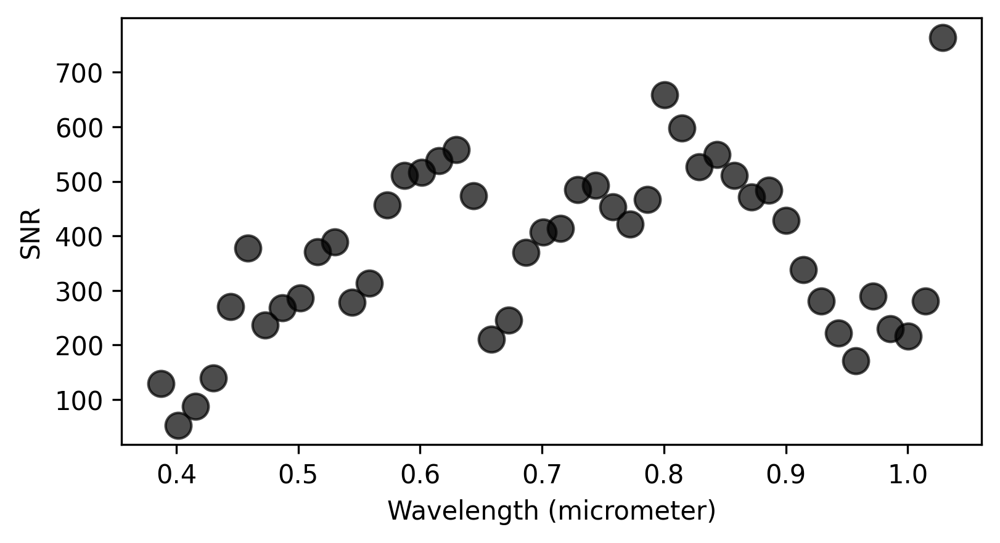

# HyperQuest

hyperquest: A Python package for estimating image-wide noise across wavelengths in hyperspectral imaging (imaging spectroscopy) with an emphasis on repeatability and speed. Computations are sped up and scale with number of cpus.


## Installation Instructions

The latest release can be installed via pip:

```bash
pip install hyperquest
```

## Methods currently available
- __(HRDSDC)__ Homogeneous regions division and spectral de-correlation (Gao et al., 2008)

- __(SSDC)__ Spectral and spatial de-correlation (Roger & Arnold, 1996)

- __(RLSD)__ Residual-scaled local standard deviation (Gao et al., 2007)

## Usage example
```python
import hyperquest
import matplotlib.pyplot as plt

# get wavelengths
wavelengths = hyperquest.read_center_wavelengths(envi_img_path)

# compute using HRDSDC method
snr = hyperquest.hrdsdc(envi_img_path, n_segments=1000, 
                        compactness=0.1, n_pca=3, ncpus=3)
plt.show()
```



## TODO:
- water mask
- helper function to test SLIC
- segment/block level SNR 
- visualizing segment level SNR
- tutorial working with airborne data
- tutoraial working with that EMIT et al. 2024 paper


## References:

- Gao, L., Wen, J., & Ran, Q. (2007, November). Residual-scaled local standard deviations method for estimating noise in hyperspectral images. In Mippr 2007: Multispectral Image Processing (Vol. 6787, pp. 290-298). SPIE.

- Gao, L. R., Zhang, B., Zhang, X., Zhang, W. J., & Tong, Q. X. (2008). A new operational method for estimating noise in hyperspectral images. IEEE Geoscience and remote sensing letters, 5(1), 83-87.

- Roger, R. E., & Arnold, J. F. (1996). Reliably estimating the noise in AVIRIS hyperspectral images. International Journal of Remote Sensing, 17(10), 1951-1962.
